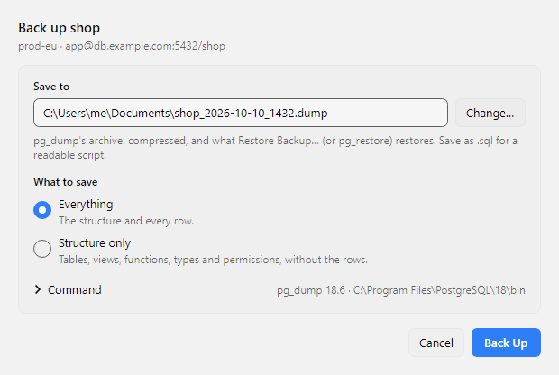
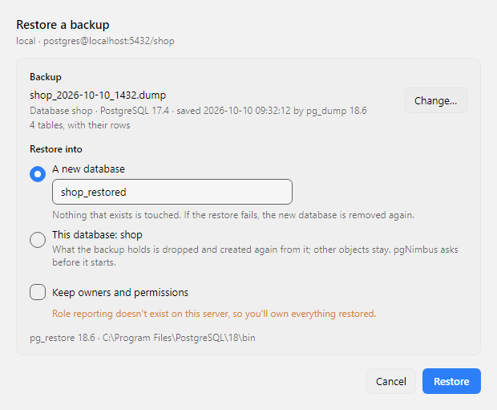

# Backup and restore

pgNimbus backs up with PostgreSQL's own `pg_dump` and restores with its
`pg_restore`, so a backup is a normal PostgreSQL backup that any PostgreSQL tool
can read. It covers the simple cases: all of a database, one schema or one
table, with or without the rows, and putting a backup back. For scheduled
backups, parallel dumps, roles and other cluster-wide objects, use a dedicated
tool such as `pg_dumpall`, pgBackRest or your cloud provider's snapshots.



## Back up a database, a schema or a table

- The whole database: **Back Up Database…** in the ☰ menu, the command palette,
  or the **File** menu on macOS.
- One schema: right-click it in the schema tree and choose **Back Up Schema…**.
- One table, with its partitions if it has any: right-click it and choose
  **Back Up Table…**.

The window asks two things:

1. **Where to save.** pgNimbus suggests a file named after the database and the
   time, in the folder you used last. **Change…** picks another.
2. **What to save.** **Everything** is the structure and every row.
   **Structure only** is the tables, views, functions, types and permissions,
   without the rows.

The kind of file follows its name:

- **`.dump`** (the default) is `pg_dump`'s compressed archive. Restore it with
  [Restore Backup…](#restore-a-backup), or with `pg_restore`.
- **`.sql`** is a plain SQL script you can read, compare and keep in Git.
  Restore it with `psql`.

Click **Back Up**. The window shows which table is being saved, how long it has
taken and how big the file is so far. You can keep working in the main window
while it runs. When it finishes, **Show in Folder** opens the folder that holds
the file.

!!! tip "A failed backup never destroys an older one"

    `pg_dump` writes to a temporary `.partial` file next to the one you chose,
    and pgNimbus moves it into place only when the backup finishes. If the
    backup fails, or you click **Stop**, the temporary file is deleted and a
    file that was already at that path stays as it was.

## Restore a backup

**Restore Backup…** is in the ☰ menu, the command palette, and the **File** menu
on macOS. It restores into the server the window is connected to.



1. **Choose the file.** pgNimbus reads what it holds before anything runs: the
   database it came from, the PostgreSQL release, when it was saved and how many
   tables it has.
2. **Choose where it goes.**
    - **A new database** (the default). pgNimbus creates it and restores into it,
      so nothing that exists is touched. It suggests the backup's own database
      name, with `_restored` on the end if that name is taken.
    - **This database.** What the backup holds is dropped and created again from
      it, rows included. Other objects in the database stay. pgNimbus asks before
      it starts.
3. **Keep owners and permissions**, or not. Kept, every object belongs to the
   role it belonged to before. A backup from another server often names roles
   this server doesn't have; pgNimbus checks, and turns this off when one is
   missing, so you own everything restored instead.

A restore is one transaction: it all happens, or none of it does. If it fails,
or you click **Stop**, the database is as it was, and a new database that
pgNimbus created for it is removed again. After a restore into a new database,
**Open in New Window** connects to it the way the current window is connected.

A backup of one schema or table can point outside itself: a foreign key to a
table in another schema, a view over one, a column of a type defined elsewhere.
In a new, empty database those aren't there and the restore stops. Restore it
into a database that has them, such as the one it came from.

pgNimbus restores `pg_dump`'s archives (`.dump`, `.backup`, `.tar`). It doesn't
restore a plain `.sql` script: that needs `psql`, and `psql` also runs any shell
commands a script holds, so run a script you trust with `psql -f` yourself.
A restore runs the SQL the backup holds as your role, so restore backups you
trust.

## Installing pg_dump

pgNimbus doesn't ship `pg_dump` and `pg_restore`, and doesn't download them. It
finds the copies that come with PostgreSQL, pgAdmin, Postgres.app or Homebrew,
in the places they install them, so most people never have to point it
anywhere.

`pg_dump` must be at least as new as the server: a PostgreSQL 17 server needs
`pg_dump` 17 or newer. A newer `pg_dump` backs up every older server, so
installing the newest release is always enough. When no copy is new enough,
the backup window says which version it needs, what it found instead, and the
steps for your system. In short:

=== "Windows"

    Download the PostgreSQL installer from
    [EDB](https://www.enterprisedb.com/downloads/postgres-postgresql-downloads),
    run it, and on the **Select Components** page leave only
    **Command Line Tools** checked. Or, from a terminal:

    ```
    winget install -e --id PostgreSQL.PostgreSQL.18 --interactive
    ```

    and choose **Command Line Tools** when the installer asks. pgNimbus finds
    `C:\Program Files\PostgreSQL\18\bin` on its own. If pgAdmin 4 is
    installed, pgNimbus can use the copy that comes with it too.

=== "macOS"

    With Homebrew:

    ```
    brew install libpq
    ```

    Or install [Postgres.app](https://postgresapp.com/downloads.html); it
    includes the client programs, and you don't have to start its server.

=== "Linux"

    On Debian and Ubuntu, add PostgreSQL's own package repository (your
    distribution's packages are often older than the server), then install the
    client:

    ```
    sudo apt install -y postgresql-common
    sudo /usr/share/postgresql-common/pgdg/apt.postgresql.org.sh
    sudo apt install postgresql-client-18
    ```

    On Fedora, RHEL and their relatives, set up the
    [PostgreSQL repository](https://www.postgresql.org/download/linux/redhat/)
    and install `postgresql18`. On Arch, install `postgresql-libs`.

Then click **Look Again** in the backup or restore window.

If your copy is somewhere pgNimbus doesn't look, open **Settings**, go to the
**Data** tab and choose the folder that holds `pg_dump` and `pg_restore`.
The same card shows which copy pgNimbus uses.

## Your password and the command line

pgNimbus starts `pg_dump` and `pg_restore` with the same server, database, user
and TLS settings as the window you started them from. It passes the password in
their environment and never on their command line, which any user on the
computer can read. Under the backup form, **Command** shows the exact command
pgNimbus runs, without the password, so you can copy it and run it yourself.

Through an SSH tunnel, both go through the window's tunnel, so keep the window
open until they finish. pgNimbus asks before closing a window whose backup or
restore is still running.
