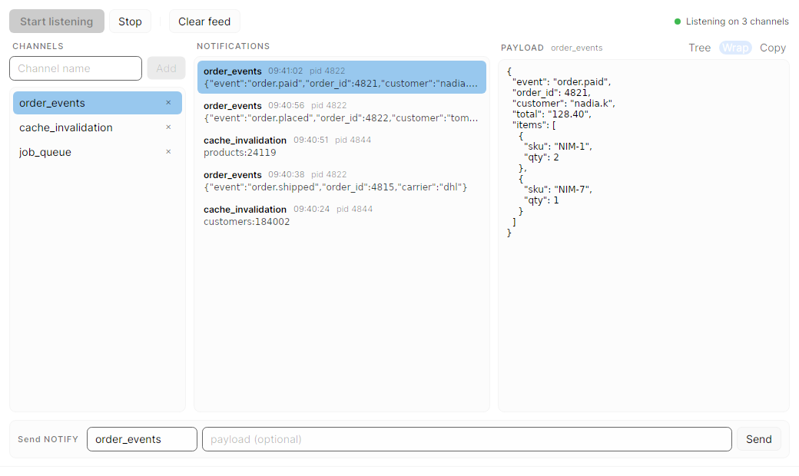

# Monitoring

All three monitoring windows open from the command palette, and on macOS from
the native Query menu. Each one opens at most a single live instance; asking
again focuses the window you already have.

## Server activity

<kbd>Ctrl</kbd>+<kbd>Shift</kbd>+<kbd>M</kbd>

Two tabs, both refreshing every two seconds.

### Backends

A live `pg_stat_activity` grid: who is connected, what they are running, how long
they have been at it, and what they are waiting on. Each backend can be cancelled
(stop the current statement) or terminated (drop the session) from the toolbar,
so a runaway query is one click away from stopping.

### Blocking

The tab worth knowing about before you need it: a who-blocks-whom lock tree. Lock
holders sit at the top, waiters nest underneath them, each labelled with the lock
it is stuck on.

It is built on `pg_blocking_pids()` rather than a hand-rolled `pg_locks`
self-join, which matters. That function understands lock groups and parallel
workers, so it gets the answer right in cases a join gets wrong. The tree copes
with chains, waiters blocked by several backends at once, blockers that are not
visible in the snapshot, and momentary deadlock cycles.

Nodes auto-expand, so the whole wait chain is visible at a glance and stays that
way across refreshes.

!!! tip "Aim at the root"

    Cancel and terminate on this tab act on the selected node. Aim at the holder
    at the top of a chain. Releasing it frees everyone nested beneath it, where
    killing a waiter achieves nothing.

## Database overview

<kbd>Ctrl</kbd>+<kbd>Shift</kbd>+<kbd>G</kbd>

A read-only health panel over the `pg_stat_*` and `pg_statio_*` views:

- database size, and the largest relations, split into heap and index
- cache hit ratios, showing how much of your working set is actually in the
  buffer cache
- sequential versus index scan counts per table, with missing-index suspects
  flagged
- unused indexes that are not backing a constraint, with the disk they are
  wasting

## LISTEN / NOTIFY monitor

<kbd>Ctrl</kbd>+<kbd>Shift</kbd>+<kbd>L</kbd>

Watch an application's event plumbing without writing a consumer. Add the
channels you care about, press **Start listening**, and every `NOTIFY` on them
arrives in the feed.

- **Payloads read as documents.** Select a notification and its payload opens in
  the pane on the right. JSON is formatted, and the **Tree** toggle browses it as
  a collapsible document, the same view the results grid uses for a `jsonb` cell.
- **Channels are remembered.** The list is saved per connection, so the monitor
  opens next time with your channels already in it. It does not start listening
  on its own; that stays one click.
- **Send a notification from here.** The send box at the bottom publishes with
  `pg_notify()`, so you can prove a channel works without opening a second
  session somewhere else.
- **A dropped connection comes back.** If the connection behind the listener
  dies, the monitor re-establishes it and re-subscribes to every channel. If it
  cannot, it says so and stops showing itself as listening. Notifications
  published while the connection was down are gone, because Postgres keeps no
  backlog for a listener that is not connected.

The feed keeps the most recent 500 notifications.

## Relation sizes in the schema tree

A dimmed size hint next to each relation in the schema tree. It is off by
default; turn on "Show relation sizes" in Preferences, under Appearance.

Views and partitioned parents show no size, because they have no storage of their
own worth reporting.

## Reference

[Every keyboard shortcut](../reference/keyboard-shortcuts.md)
